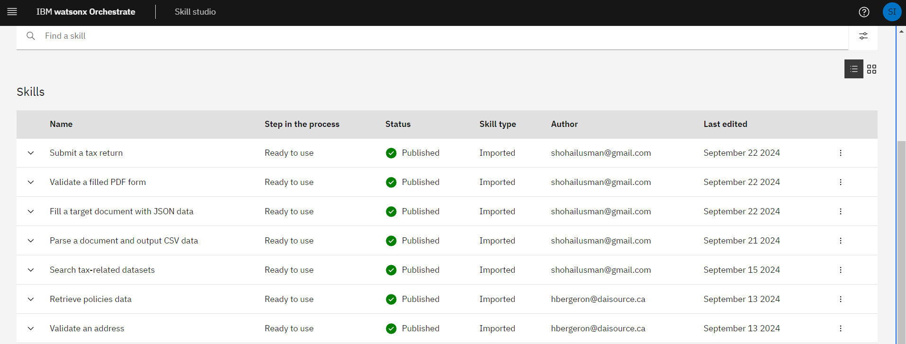

# TaxGenie

   * [Background Information](#background-information)
   * [Core Features](#core-features)
   * [Limitations and Future Developments](#limitations-and-future-developments)
   * [Environment Setup](#environment-setup)


# Background Information

TaxGenie is a tool developed for the IBM watsonx TechXchange hackathon, with the attached code being a prototype/proof of concept. It is an AI-powered assistant designed to streamline the year-end tax filing process for Canadian individuals and businesses. It simplifies tasks like tax form filling, error-checking and data validation through an automated workflow in IBM watsonx Orchestrate (wxO), utilising APIs for each step (or 'skill') in the pipeline. For a more detailed explanation, see our [Hackathon Proposal](IBM_Hackathon_Proposal.pdf)


# Core Features

The main technologies used are APIs, which form skills in the wxO roadmap, with the intended chnronological workflow being:

1. **Document parsing and data extraction**: PDF.co's Document Parser API has been used to extract key-value pairs from a completed passed-in tax-related form (e.g., T4). This file is then outputted as a CSV, which will be transformed into a JSON.

2. **Document filling**: PDF.co's PDF Edit API was then used to fill in an empty target dicument document (e.g., T1) by identifying keys and using the corresponding JSON data from Step 1. IBM's watsonx.ai is also used to parse the document and prompt the user for information on fields (if any) that do not have corresponding data to fill them.

3. **Searching tax-related datasets**: A Canadian Revenue Agency(CRA) certified API is used for this, namely the Open Government of Canada API for gathering information on tax-related legislation. This API will mainly serve as a dataset to be fed into the next step.

4. **Tax policy retrieval**: This data is ingested into the IBM Watson Discovery API where the Granite LLM will be trained specifically on these datasets. Watson Discovery then cross-references the filled form against the latest regulations to check for accuracy and compliance. If discrepancies or missing fields are found, watsonx.ai prompts the user to correct or provide additional information, ensuring the form is complete and legislation-compliant.

5. **Human error-checking**: IBM RPAs can be integrated with the Jira API to automate the error-checking process by creating RPA bots to log any issues detected by Watson Discovery in Jira. This allows for a human-in-the-loop AI system, thus minimising chance of errors in the final completed T1 form.

6. **File submission**: NETFILE API is used to send these final forms to the CRA, as per their website on sending tax returns electronically. 


### [Intended wxO pipeline](Project-documentation/Workflow.pdf)


### Current watsonxOrchestrate skill tree




# Limitations and Future Developments

 * While testing the workflow in wxO, it was found that PDF.co's Document Parser API was not working due to an Internal Server Error 500, caused by an issue with processing the file tokens used for uploading documents. This error prevented the API from extracting data from the uploaded tax forms, which delayed process significantly. Despite multiple attempts to resolve the issue, including interactions with PDF.co's support team, the server-side error could not be solved, and so we focussed on the rest of the pipeline due to time constraints.
 * The process to transform a CSV to JSON file in step 1 is not automated, however this is something that is planned in future iterations.
 * The CRA API was not able to be debugged fully due to time constraints, but is planned to be improved in future iterations.
 * The Jira API was not able to be implemented due to time constraints, but is planned for future iterations.

# Environment Setup

Replace the following environment variables with your own credentials before using the API calls:

```
${APP_ID} = Custom application ID to allow API calls to be imported into wxO as a skill
${IBM_API_KEY} = API key for IBM RPA API
${PDFCO_API_KEY} = API key for PDF.co Document Parse and PDF Edit APIs
${TEMPLATE_ID} = ID for Document Parser template used through PDF.co
${FILE_TOKEN} = Token to retrieve and use file uploaded to PDF.co's cloud storage
```
